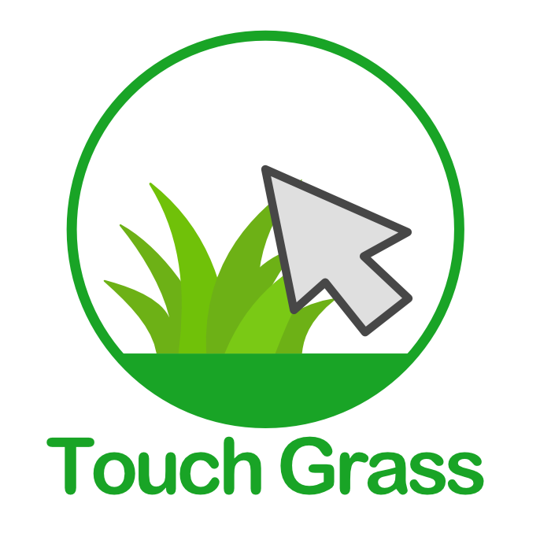
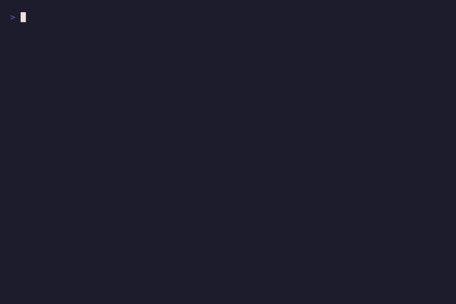

<div align="center">

<picture>
  <source media="(prefers-color-scheme: dark)" srcset="./touch_logo_dark.png" />
  <source media="(prefers-color-scheme: light)" srcset="./touch_logo.png" />
  
</picture>

# go-touch-grass

### Your terminal knows you need to go outside. This CLI will tell you why.

[](https://www.npmjs.com/package/go-touch-grass)
[](https://www.npmjs.com/package/go-touch-grass)
[](https://marketplace.visualstudio.com/items?itemName=lexCoder.gotouchgrass)

</div>

<!-- DEMO GIF — record with: ./scripts/record-demo.sh -->
<p align="center"></p>

```bash
npx go-touch-grass
```

That's it. Run it. Get roasted. Go outside.

---

## Why this exists

You've got a 500-day commit streak. Your GitHub contribution graph is so green it could photosynthesize. Your IDE has a darker dark mode than your under-eye circles.

Somewhere between your 47th open tab and your third energy drink, you forgot that the sun is a real thing. Your posture looks like a question mark. Your Vitamin D levels are in the "have you considered living above ground?" range. Your therapist has started billing you in story points.

**go-touch-grass** is an intervention disguised as a CLI tool:

- **Roasts you** with one of 31+ messages about your screen-addicted life choices
- **Shows you what outside looks like** via ASCII art (because you've forgotten)
- **Tracks your outdoor streak** — same dopamine as a GitHub graph, but good for you
- **Assigns a 10-minute break** with a countdown timer, because apparently adults need to be told when to go outside
- **Lets you share on social media** — if you touched grass and didn't tweet about it, did it even happen?

We built this because we *are* the target audience. We are the 2am debug session. We are the "I'll go outside after this PR." We are the reason this tool exists.

---

## Get it

```bash
npx go-touch-grass           # zero install, just run it
npm install -g go-touch-grass # or install globally if you're committed (to self-care)
```

Also available as a [VS Code / Cursor extension](https://marketplace.visualstudio.com/items?itemName=lexCoder.gotouchgrass) — streak counter in your status bar, reminders, the whole thing.

---

## What it does

```
        ^        *   *
       /|\          *
      / | \
  ___/  |  \___
 (  touch    )
  \  grass  /
   \       /
~~~~~~~~~~~~~~~~~~~~

────────────────────────────────────────────────────────
>>> You have been in dark mode for 14 hours.
    The sun has better rendering.
────────────────────────────────────────────────────────
  streak: 5 days | total: 42 touches | longest: 12 days
────────────────────────────────────────────────────────

   ╭─────────────────────────────────╮
   │   ⏱ YOUR OUTDOOR ASSIGNMENT    │
   │   Duration: 10 minutes          │
   │   Return by: 3:45 PM           │
   │                                 │
   │   Do NOT touch your keyboard.   │
   │   Do NOT check Slack.           │
   │   Touch grass. Breathe air.     │
   ╰─────────────────────────────────╯
```

One touch per day. Streaks reset if you skip a day. Milestones at 1, 5, 10, 25, 50, and 100 touches.

---

## Flags for the impatient

```bash
npx go-touch-grass --streak       # just show me my stats
npx go-touch-grass --share        # share to Twitter/X, LinkedIn, or Instagram
npx go-touch-grass --noTimer      # skip the countdown
npx go-touch-grass --noShare      # skip the social media prompt
npx go-touch-grass --time 5       # 5-minute break instead of 10
npx go-touch-grass --help         # you know what this does
```

---

## Your data

All local. No cloud. No telemetry. No accounts. Just a tiny JSON file:

- **Linux / macOS:** `~/.config/go-touch-grass/config.json`
- **Windows:** `%APPDATA%\go-touch-grass\config.json`

---

## Contribute

Honestly? We'll take anything. This is a CLI that tells people to go outside — we're not guarding the gates here.

- **ASCII art scenes** → [`src/art.js`](./src/art.js) — arrays of strings, 80 columns wide
- **Roast messages** → [`src/messages.js`](./src/messages.js) — under ~100 chars, must be funny at 2am
- **Wild ideas** — Python port? Homebrew formula? A cron job that runs it during your CI pipeline? A build that runs on your fridge? Yes. All of it. [Open an issue](https://github.com/lexCoder2/touch-grass-js/issues) and let's talk.
- **Bug fixes** — if you found a bug in a tool that tells you to go outside, that's honestly impressive. Fix it and we'll merge it between outdoor breaks.
- **New platforms** — Android widget, Slack bot, Raycast extension, a version that works on your smart toaster — if it has a screen, it should be telling someone to touch grass.
- **Improvements** — better streaks, new milestones, sound effects, whatever. If it makes the experience more fun without making it *serious*, we're in.

The only rule: keep it fun. This is a joke that accidentally became wellness software. Let's keep it that way.

[Open an issue](https://github.com/lexCoder2/touch-grass-js/issues) · [Start a discussion](https://github.com/lexCoder2/touch-grass-js/discussions)

---

<div align="center">

[GPL-3.0](./LICENSE) · Made for developers who need a reminder to go outside

**Your code will still be there in 10 minutes. Your mental health might not be.**

</div>
