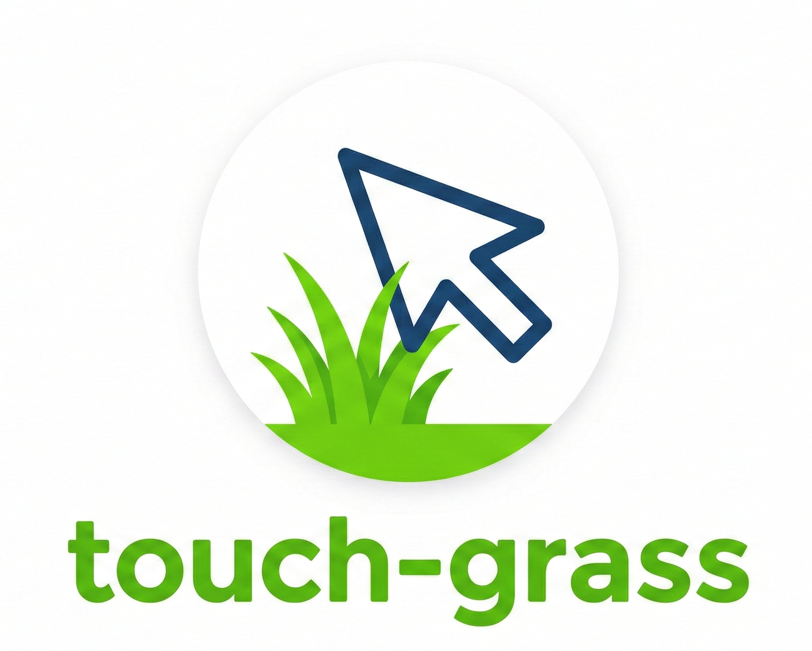

# Go Touch Grass — VS Code / Cursor Extension

<p align="center">
  
</p>

> The `go-touch-grass` CLI, now living rent-free inside your editor.

## Features

| Feature | Description |
|---|---|
| **Status bar streak** | Persistent streak counter lives in the right side of the status bar (`🌿 3 day streak`). Click it to open the panel. |
| **Grass panel** | A full terminal-themed webview with a random ASCII art scene, a sarcastic wellness message, and your streak data. |
| **10-min outdoor timer** | In-panel countdown with a progress bar — runs entirely in the webview, no terminal needed. |
| **Social sharing** | Share to Twitter/X, LinkedIn directly, or copy text for Instagram — straight from the panel or via command. |
| **Periodic reminders** | A notification pops up every N minutes (configurable) with a random message and a one-click "Touch Grass Now" button. |

## Commands

All commands are available via the Command Palette (`Ctrl+Shift+P` / `Cmd+Shift+P`):

| Command | Description |
|---|---|
| `Touch Grass: Go Outside Now` | Opens the grass panel and increments your streak |
| `Touch Grass: Show Streak Stats` | Quick-pick notification with your stats |
| `Touch Grass: Share Achievement` | Opens platform picker → launches share URL |
| `Touch Grass: Reset Streak` | Full streak reset (confirms before wiping) |

## Settings

```jsonc
{
  // Enable periodic in-editor reminders
  "touchGrass.enableReminders": true,

  // How often to show reminders (minutes, minimum 5)
  "touchGrass.reminderIntervalMinutes": 60
}
```

## Development

```bash
cd vscode-extension
npm install
npm run compile      # one-time build
npm run watch        # watch mode during development
```

To test locally, open the `vscode-extension` folder in VS Code and press **F5** to launch the Extension Development Host.

## Packaging

```bash
npx @vscode/vsce package
```

This generates a `.vsix` file you can install with:

```bash
code --install-extension go-touch-grass-1.0.0.vsix
```

---

Part of [go-touch-grass](https://github.com/lexCoder2/touch-grass-js) — also available as `npx go-touch-grass`.
